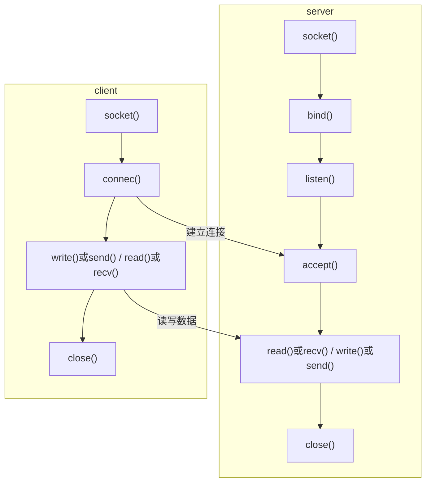

## linux socket ##
是应用层与TCP/IP协议族通信的中间软件抽象层，它是一组接口。即Socket提供了操作上述特殊文件的接口.使用这些接口可以实现网络编程。

TCP使用socket创建一般步骤:

 - 服务器
  1.创建一个socket，用函数socket()；
  2.绑定IP地址、端口等信息到socket上，用函数bind();
  3.开启监听，用函数listen()；
  4.接收客户端上来的连接，用函数accept()；
  5.收发数据，用函数send()和recv()，或者read()和write();
  6.关闭网络连接；

 - 客户端
  1.创建一个socket，用函数socket()；
  2.连接服务器，用函数connect()；
  3.收发数据，用函数send()和recv()，或者read()和write();
  4.关闭网络连接；

编译运行:

 -  g++ server.cpp -o server
 -  g++ client.cpp -o client
 -  ./server
 -  ./client

